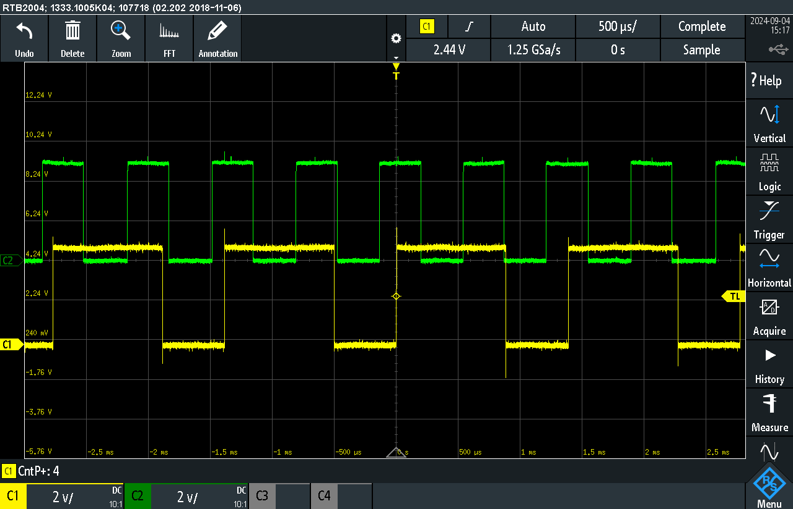
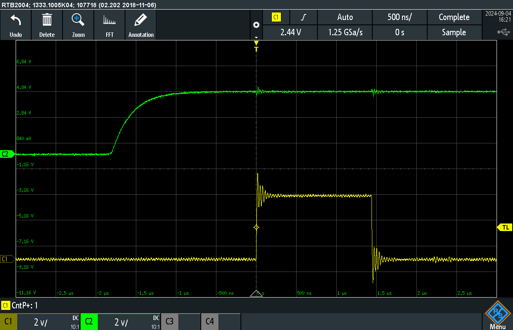

See [[Project 1 Motor encoder Description]] for details

# Part 1 
Motor does 155rpm  
Motor has 100:1 gear ratio  
Sensor has 7 pole pairs

### Maximum pulse rate correctly computed

Motor turnes with 15000 rpm  
in seconds -> 15000 rpm / 60s = 250 rps  
Take account for 7 pole pairs of hall sensor: 250 Hz * 7 = 1,75 kHz

### Sampling rate guarantees no missed pulses
Period time is 571 $\mu s$, accurate sampling at least 2x faster than turning speed (nyquist): at least 3,5 kHz better 3,85 kHz or 4 kHz. -> $250 \mu s$ (4 kHz) works with detecting rising edges 

Picture 1: Every rising edge of CH2 leads to a rising edge on CH1 in the same period. 

### Encoder driver class hides the hardware

    #include <stdint.h>
    #include <stdbool.h>
    #include <digital_in.h>

    class encoder
    {
    private:
        uint8_t encoder_pin;
        Digital_in EncoderAPin;
        Digital_in EncoderBPin;
        volatile uint16_t ui16EncoderPos = 0;
    public:

        void init(void);
        int16_t position(void);
        void update(void);

        encoder(int8_t pin_A_number, int8_t pin_B_number);
        ~encoder();
    };

### Counter incremented and decremented based on the direction of rotation.
Is shown in video: https://youtu.be/w5mNr-y7vdo?si=2qofOPMEl1Y-GstD

### Response measured on scope
See pictures and video.

### Counting verified
See video.

# Part 2

### Effect of printing established and compared to Part1
In case the timing is done with a delay, the execution of the serial function takes to long and interferes with the counting of the encoder signal.

Picture 2: Unlike in picture 1 the periods of CH1 are much longer than the periods in CH1. This indicates that the serial output needs too much time.

### Code count printed
See video

# Part 3

## Resource allocation
RAM:   [=         ]   9.1% (used 187 bytes from 2048 bytes)
Flash: [          ]   4.8% (used 1462 bytes from 30720 bytes)

## Implementation
The LED on PB5 is used as an output pin and display internal states.

The external interrupt INT0 is used and triggering on a rising edge of Encoder signal A.

In the ISR of INT0_vect the LED is set high then the update function of the encoder is called and the LED is set low, before leaving the ISR.

In the main function, the encoder count is printed to the serial console using the Arduino serial class.

## Measurement setup
Oszi CH1: Output of Controller pin PB5
Oszi CH2: Encoder Signal A

## Results
Triggering on every rising edge worked fine.
Execution of ISR needs $$1.5 \mu s $$

### Interrupts implemented in driver class
    void encoder::init(void)
    {
        // use external interrupt 0 
        EICRA = (1 << ISC01) | (1 << ISC00); // The rising edge of INT0 generates an interrupt request.
        EIMSK = (1 << INT0); // External Interrupt Request 0 Enable
    }

### Validation and comparison Part 2
Serial output and interrupt are handled seperately.

With this implementation the maximum encoder signal frequency can be 1/3.5 us = 285 kHz.

# Video and code in git repo
Video: https://youtu.be/w5mNr-y7vdo?si=2qofOPMEl1Y-GstD
Git: https://github.com/UniRoi/Motor_encoder.git
