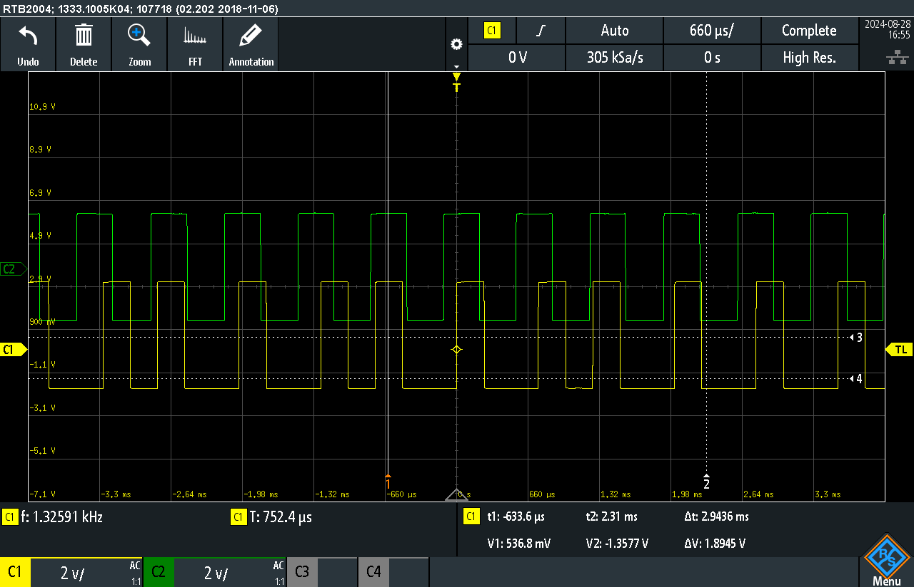

See [[Project 1 Motor encoder Description]] for details

# Part 1 
Motor does 155rpm  
Motor has 100:1 gear ratio  
Sensor has 7 pole pairs

Motor turnes with 15000 rpm  
in seconds -> 15000 rpm / 60s = 250 rps  
Take account for 7 pole pairs of hall sensor: 250 Hz * 7 = 1,75 kHz

Period time is 571 $\mu s$, accurate sampling at least 2x faster than turning speed (nyquist): at least 3,5 kHz better 3,85 kHz or 4 kHz. -> $250 \mu s$ (4 kHz) works with detecting rising edges 

